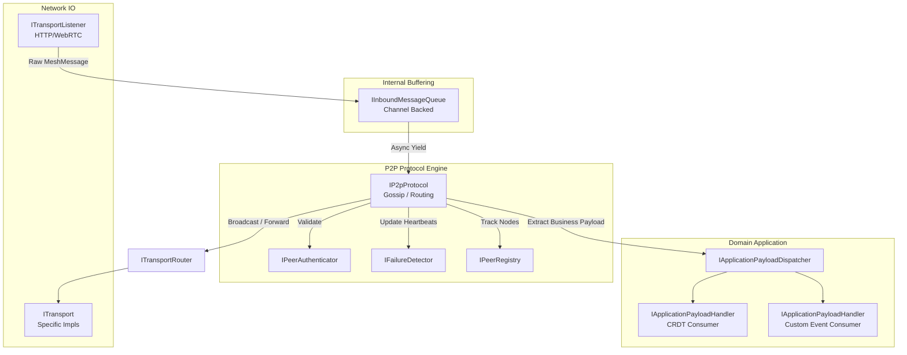
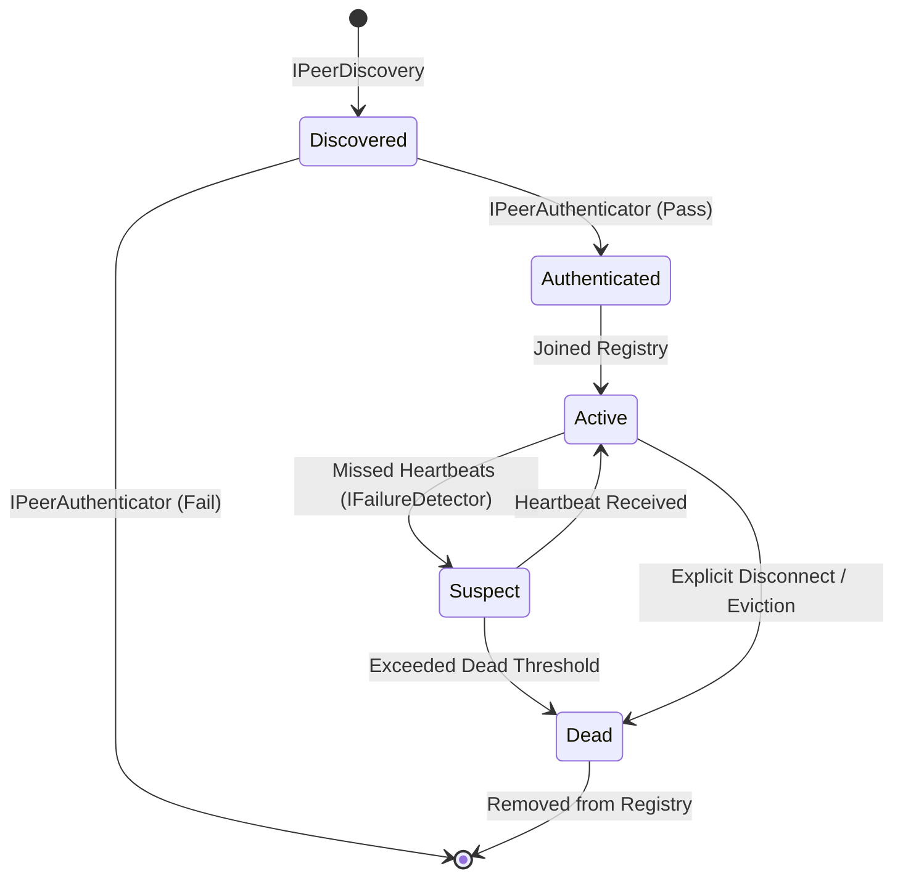
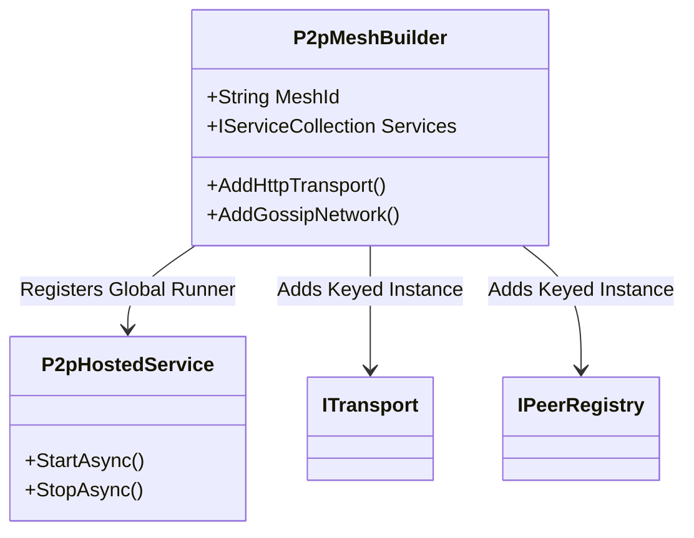

# Ama.Enterprise.P2p Architecture and Design

## Overview
The `Ama.Enterprise.P2p` module provides a distributed peer-to-peer networking foundation designed for multi-mesh topologies. It leverages Keyed Dependency Injection to isolate network contexts ("meshes") within a single application space. The architecture separates network transport, peer tracking, lifecycle management, and protocol distribution into distinct boundaries.

## Core Component Groupings

### 1. Application Integration
Bridges the underlying networking layer with domain-specific consumers.
- **`IApplicationPayloadDispatcher`**: Takes unwrapped byte arrays from the protocol and distributes them to localized domain handlers.
- **`IApplicationPayloadHandler`**: The domain-level interface. Consumers implement this to receive business payloads (e.g., CRDT operations) without being tightly coupled to P2P envelopes.

### 2. Transport & Networking
Manages abstract network Input/Output capabilities.
- **`ITransportListener`**: Generic listener for inbound protocol messages.
- **`IInboundMessageQueue`**: A channel-backed buffer decoupling raw socket/network receives from processing loops to avoid blocking I/O.
- **`ITransport`**: Represents an outbound mechanism (e.g., HTTP, WebRTC).
- **`ITransportRouter`**: A composite router evaluating which `ITransport` implementation should handle an outbound envelope based on the peer's endpoint type.

### 3. Peer Management & Topology
Tracks external peers, their health, and triggers system-wide reactions to network changes.
- **`IPeerRegistry`**: Thread-safe in-memory map of known peers and their statuses (`InMemoryPeerRegistry`).
- **`IPeerTopologyObserver`**: Implementing an observer pattern, allows external services to react when peers join, leave, or change status.
- **`IPeerSelector`**: Algorithms (like `RandomPeerSelector`) to pick subsets of nodes for distribution operations like Gossip.
- **`IPeerDiscovery`**: Mechanisms to actively find new peers (e.g., UDP multicast).

### 4. Protocol & Lifecycle
Orchestrates the active node logic.
- **`IP2pProtocol`**: The overarching engine (e.g., `GossipProtocol`) that binds the queue, the dispatcher, and the routing tables.
- **`IFailureDetector`**: Evaluates heartbeats to transition nodes between Active, Suspect, and Dead states (`TimeBasedFailureDetector`).
- **`IPeerAuthenticator`**: Ensures valid handshakes.

---

## Architectural Diagrams

### Message Flow Architecture

### Peer Lifecycle

### Dependency Injection Pipeline

The system uses Keyed Services to register independent singletons per `MeshId`.

## System Standards and Serialization
- Extensively uses `System.Text.Json` combined with `IJsonTypeInfoResolver` (e.g., `P2pJsonSerializerContext.Default`) to ensure compatibility with Native AOT compilation.
- Polymorphic mapping natively limits the use of reflection when reading generic network envelopes.