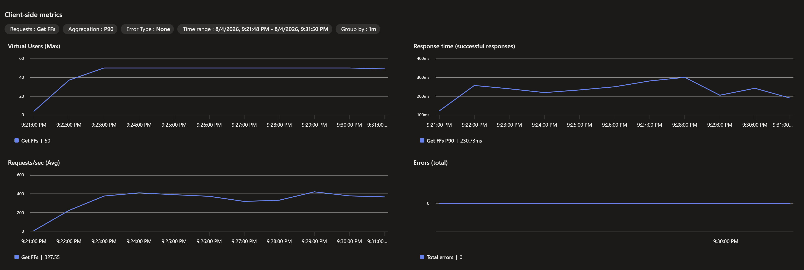
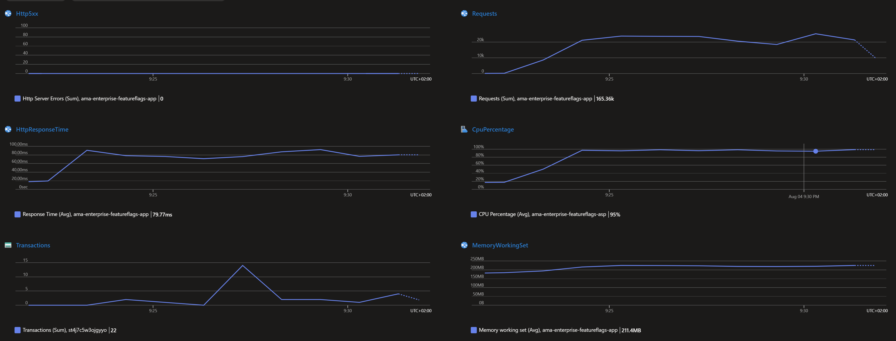
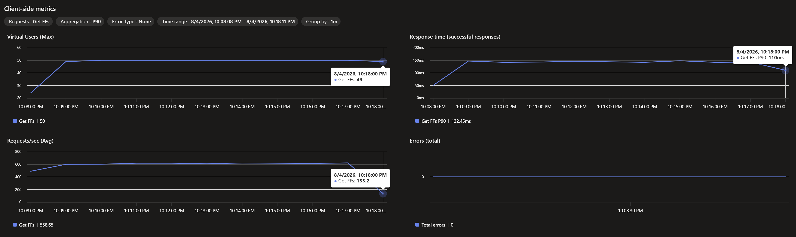
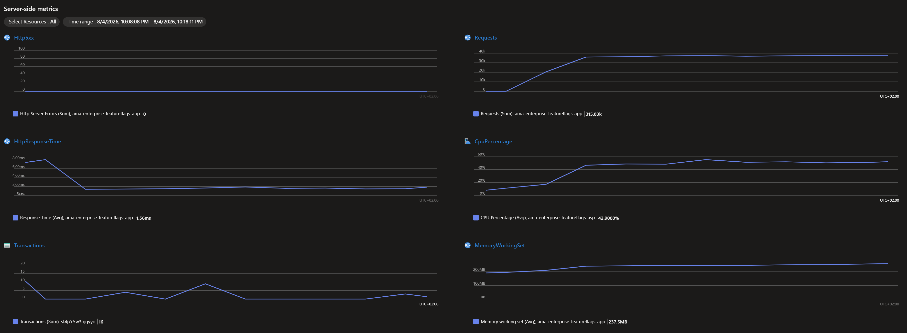
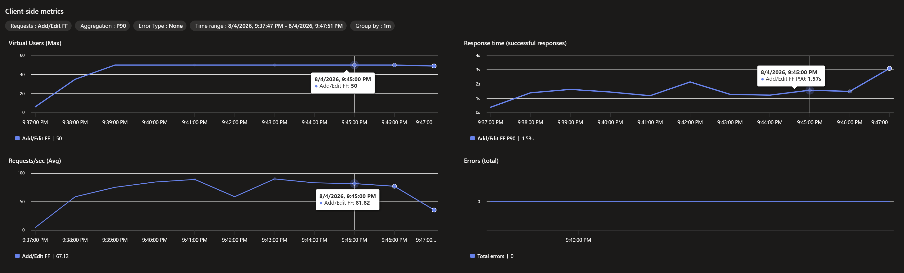
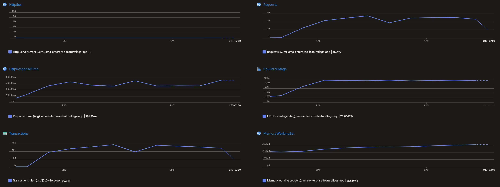
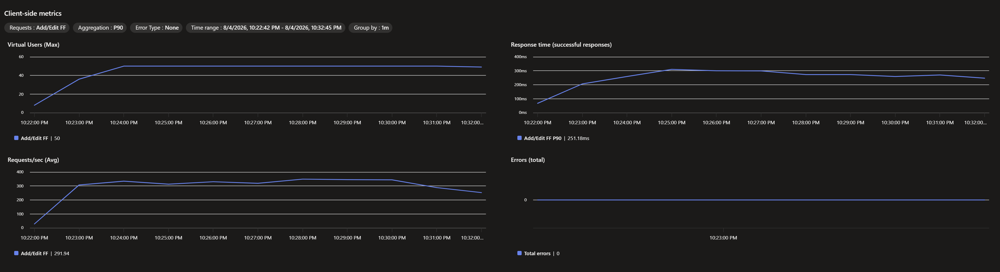
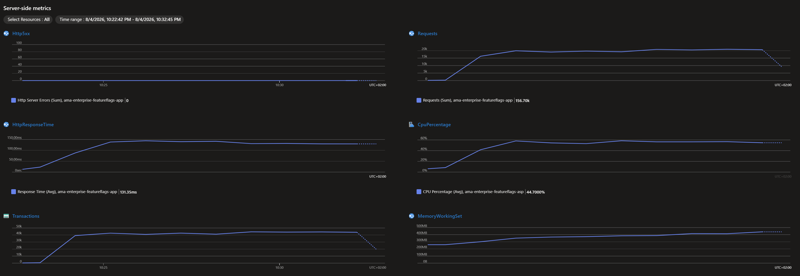

# Load Tests

The application subjected to these load tests is available here:
[Ama.Enterprise.Samples.HttpLoadBalancerPollingFeatureFlags](https://github.com/phaetto/Ama.Enterprise.Samples/tree/master/02-Scenarios/02-SassBackend/Ama.Enterprise.Samples.HttpLoadBalancerPollingFeatureFlags)

## Scenarios
Two primary scenarios were tested in Azure:
- Read Feature Flags: Reads all available feature flags.
- Update Feature Flag: Updates a single feature flag.

At the time of testing, the amount of feature flags in memory was minimal (2-3 flags).

The testing environment and application setup were identical for both scenarios:
- Compiled with Native AOT, trimming enabled, and the balanced profile.
- Serialization handled via MessagePack.
- External API protocol: HTTPS (TLS 1.2).
- Internal P2P protocol, discovery, and handshakes: HTTP.
- Node authentication: X.509 Certificates.
- Data-in-transit security: AES-GCM Encryption/Decryption for every message.
- Database: Azure Table Storage.
- Cluster size: 3 Nodes.

Both tests ran for 10 minutes using a single load engine, simulating 50 concurrent users with a 1-minute ramp-up time.

## Read Feature Flags
This load test demonstrates that the CRDT memory cache effectively eliminates the need for storage transactions during read operations. Because of the framework's architecture, reads are served entirely from memory, while writes incur minimal targeted changes (journaling).

### B1 App Service Plan

The B1 plan is the smallest available Azure App Service plan. It utilizes a burstable instance, meaning sustained usage degrades performance. It provides the equivalent of 0.1 vCPU of continuous compute power, though it theoretically bursts up to 1 vCPU, accompanied by 1.75GB of memory.

Notable metrics:
- 0 errors: The P2P framework handled all requests without a single failure, even under resource starvation.
- ~330 requests/second throughput.
- 230ms average user response time.
- 80ms average internal processing time.
- 224MB average memory working set.
- 15 Table Storage transactions: Proves that the core heavily favors memory for the read path, avoiding the database entirely.
- CPU capped at 100%, throttled down to the 0.1 vCPU baseline limit.

### P0v3 App Service Plan

The P0v3 plan is the smallest premium plan, featuring 1 vCPU and 4GB of memory.

Notable metrics:
- 0 errors: The framework maintained high resilience and stability.
- ~330 requests/second throughput.
- 132ms average user response time.
- 1.56ms average internal processing time (an exceptional metric).
- 240MB average memory working set.
- 16 Table Storage transactions: Consistent with the B1 test, the database is bypassed for reads.

*Note: During this test, the CPU on the load-generating engine itself capped at 100%, while the server processing the requests only reached 60% CPU utilization. The server outperformed the load generator.*

## Write Feature Flag
This scenario stresses the framework, as updates require substantial computational work. When a CRDT is updated, the following pipeline executes:

1. Receive the HTTPS payload via the API.
2. Generate the operations and patches that describe the intended CRDT changes.
3. Apply the operations to the local node's state.
4. Serialize the changes using MessagePack and persist them to Table Storage (journaling).
5. Gossip the intent to the other nodes via HTTP (triggering two outbound HTTP calls).
6. Encrypt the outgoing payloads using AES-GCM.
7. Calculate the CRDT convergence math (Dotted Version Vectors) across the cluster.

Simultaneously, the receiving nodes must decrypt, deserialize, and apply these operations. This cross-chatter occurs across all nodes continuously, as the external load balancer distributes the API calls across the cluster.

### B1 App Service Plan

Notable metrics:
- 0 errors: The system processed the heavy write workload without failing, despite severe resource starvation.
- ~70 requests/second: Demonstrates the system's ability to naturally apply backpressure and throttle processing when under extreme pressure.
- 1.53s average user response time, reflecting the constrained compute resources.
- 581ms average internal processing time.
- 200MB to 300MB memory working set growth, stabilizing quickly.
- 99.3K Table Storage transactions: Reflects the aggressive journaling mechanism persisting every serialized structural change.
- CPU capped at 100% and throttled to the 0.1 vCPU baseline.

### P0v3 App Service Plan

Notable metrics:
- 0 errors: Sustained high reliability under heavy structural load.
- ~291 requests/second throughput.
- 251ms average user response time.
- 131ms average internal processing time.
- 350MB to 439MB memory working set, peaking and stabilizing without runaway allocations.
- 340K Table Storage transactions: As the compute resources scaled up, the framework dynamically scaled its throughput, resulting in nearly 3.5x more database transactions.